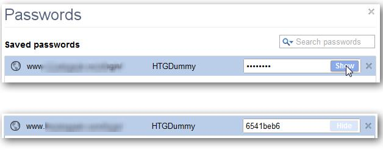
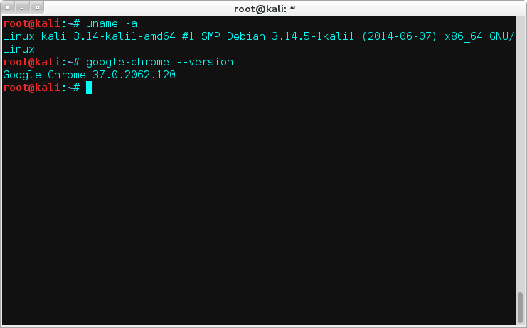
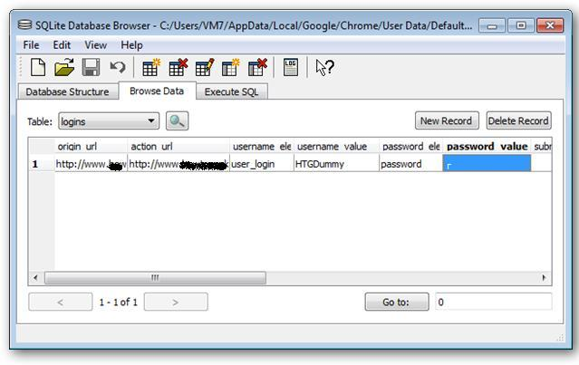
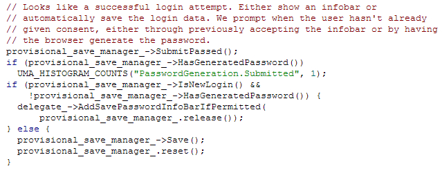
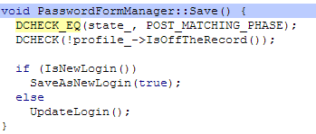
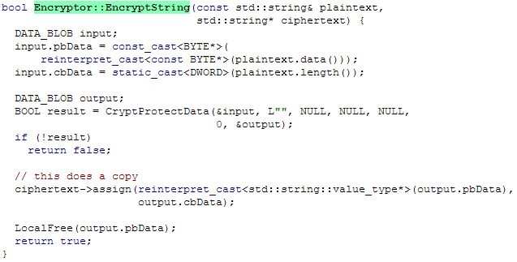

Psychic-meme
============
Chrome浏览器保存密码查看器

###0x00 Preface
鉴于现在浏览器都是标配的记住密码，而用户为了方便一般也会主动选择记住密码，但是各大浏览器保存密码机制相当简单和脆弱，仅仅是提供了一种虚假的安全感，更有甚者明文保存，简直就是形同虚设。
本文将对目前主流市场的浏览器的保存密码机制进行分别讨论，并提供PoC进行验证。

###0x01 Chrome
我们从Chrome浏览器开始。令人失望的是，chrome浏览器是最容易被提取密码的。

手动查看已保存的密码：
你可以通过设置→显示高级设置→密码和表单→管理已保存的密码来查看所有保存的密码，或是直接在地址栏输入chrome://settings/passwords来查看。


点击密码区域，显示一个“显示”按钮，再点击“显示”按钮，可看到密码。



如果他人能够物理接近你的电脑，也就意味着他就可以拿到你浏览器所有已保存的密码。

下面我们分别看看在不同系统下Chrome是如何保存密码的。
Linux：
下面是本实验系统环境和Chrome版本。



Chrome密钥一般存储在`~/.config/google-chrome/Default/Login Data`下的一个SQLite数据库中。
我们用SQLite Database Browser打开这个文件(Login Data)，惊讶的发现密钥居然是明文保存的，果然是裸奔啊，这个我就不截图了。。

Windows:
>
实验环境
>>
* Windows 8.1
* Chrome 37.0.2062.124

密钥存储于`%APPDATA%\..\Local\Google\Chrome\User Data\Default\Login Data`下的一个SQLite数据库中。
我们还是用SQLite Database Browser，查看“logins”表格，该表就包含了被保存的密码。但是于Linux不同的是，你会看到“password_value” 域的值是不可读，因为值已加密。



加密后的数据的真的安全了吗，让我们先看看到底是怎么加密的。
下面是一位国外的大牛通过读Chromium源码来分析密码是如何转储的。

当用户访问网站时，Chrome会首先判断此次登陆是否是一次成功的登录，判断代码片段：



如果成功登录，并且使用的是一套新的证书，这个证书是浏览器之前没有生成过的，Chrome就会生成一个提示条，询问用户是否需要记住密码：


当点击“保存密码”时，就会调用Chrome密码管理器的“保存”函数来响应操作：



如果是一次新的会话登录，就以如下代码执行保存：


在这函数被调用之后，执行AddLoginImpl()函数的任务被调用。这是用来使界面快速响应的：


该函数会调用登陆数据库对象的AddLogin()函数，以检查其操作是否成功。下面就是AddLogin()：


这里有些有趣的东西。我们利用用户密码生成一个字符串密钥。这段代码已经减掉了，但是”sql:Statement”行下面，执行了一个SQL查询语句，实现了在登录数据文件中存储加密数据。该EncryptedString函数仅仅是在一个加密对象上简单调用了EncryptString16函数（就是下面这个）：



最终，我们看到密码是调用Windows API函数CryptProtectData来加密的，该API只允许用于加密密码的Windows用户账户去解密已加密的数据。。这意味着，只有用加密时使用的登陆证书，密码才能被恢复。而这根本不是问题，恶意软件通常就是在用户登陆环境下执行的。

我们的目的是从这个数据库中抽取出action_url,username_value和password_value（是二进制数据，所以SQLite浏览器不能显示）。而破解密码，只需要调用Windows API中的CryptUnprotectData函数。这里我们用的是Python，Python为调用Windows API准备了一个完美的叫做pywin32的库。


注：由于chrome的保护机制，当你重设了Windows账号密码，随后尝试在Chrome中查看你的密码，密码数据都是不可用，因为“主密码”并不匹配。同样的，如果把SQLite数据库文件复制，并尝试在另外一台电脑上打开，也一样无法查看。

附上PoC：
```python
from os import getenv
import sqlite3
import win32crypt
 
# Connect to the Database
conn = sqlite3.connect(getenv("APPDATA") + "\..\Local\Google\Chrome\User Data\Default\Login Data")
cursor = conn.cursor()
# Get the results
cursor.execute('SELECT action_url, username_value, password_value FROM logins')
for result in cursor.fetchall():
 
# Decrypt the Password
    password = win32crypt.CryptUnprotectData(result[2], None, None, None, 0)[1]
    if password:
        print 'Site: ' + result[0]
        print 'Username: ' + result[1]
        print 'Password: ' + password
```

Mac OS X:
博文正在努力加载中...

###0x02 IE
>
实验环境
>>
* Windows 8.1
* IE 10

博文正在努力加载中...

###0x03 Firefox
博文正在努力加载中...

###0x04 Safari
博文正在努力加载中...

###0x05 Sougou Browser
博文正在努力加载中...

###0x06 360 Browser
博文正在努力加载中...

###0x7 References
[0].[How Google Chrome Stores Passwords](http://tech.pro/tutorial/828/how-google-chrome-stores-passwords)
[1].[浏览器保存密码原理及密码查看](http://www.cnseay.com/4059/)
[2].[浅析Chrome浏览器中保存密码那些事儿](http://os.51cto.com/art/201212/370210.htm)